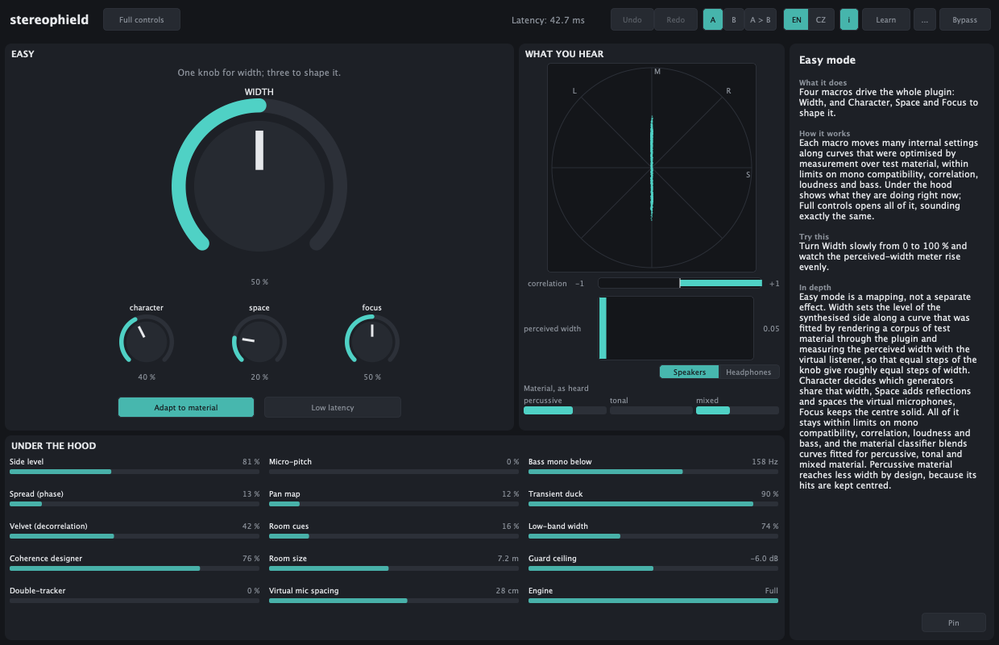
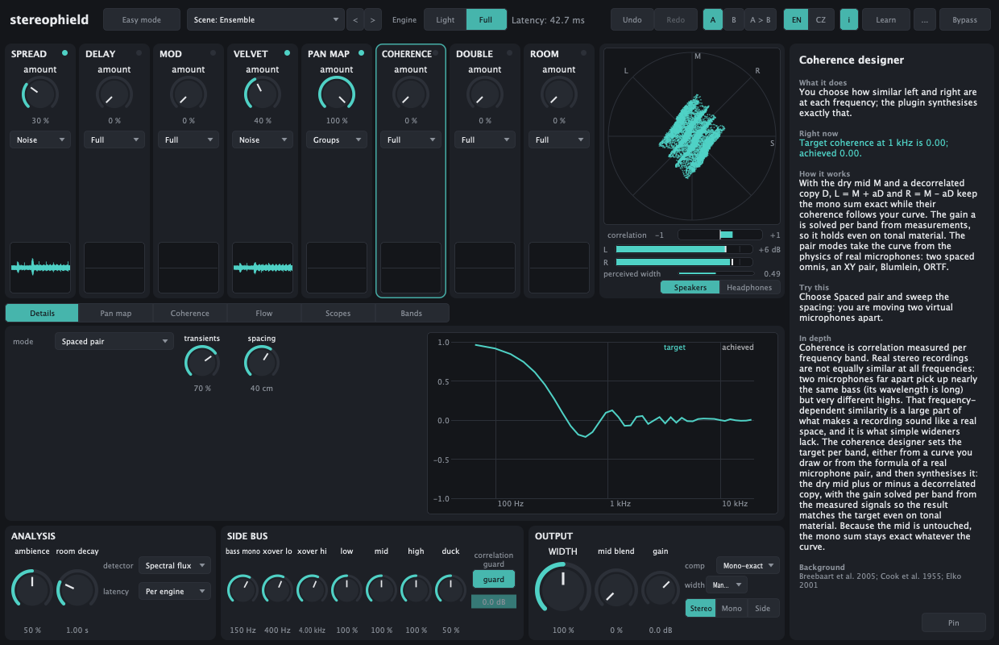

# stereophield

A mono-to-stereo widening Audio Unit and Standalone app for macOS on Apple Silicon, built from classical signal processing only. Its output sums back in mono to the untouched input: every algorithm adds to the side signal, and the mid is only delayed, never filtered. The interface is in English and Czech, and it teaches stereo widening as you use it.

It opens in **Easy mode**: one Width knob and three to shape it. **Full controls** opens the complete instrument underneath, sounding exactly the same.



## Install

Download the latest release from [Releases](https://github.com/highda/stereophield/releases):

- `stereophield-<version>-macOS.pkg` installs the Audio Unit to `/Library/Audio/Plug-Ins/Components` and the Standalone app to `/Applications`.
- `stereophield-<version>-AU.zip` and `-Standalone.zip` contain the same, to copy by hand (for example the AU into `~/Library/Audio/Plug-Ins/Components`).

Requires macOS 12 or later on Apple Silicon. The builds are not signed or notarised: if macOS blocks the package, right-click it and choose Open, or remove the quarantine flag:

```bash
xattr -dr com.apple.quarantine /Library/Audio/Plug-Ins/Components/stereophield.component /Applications/stereophield.app
```

## Easy mode

| Control | What it does |
| --- | --- |
| **Width** | Perceived width, from mono to as wide as stays natural; even steps of the knob give even steps of width |
| **Character** | How the width is made: clean (phase) at 0 %, diffuse (decorrelation, virtual microphones) at 50 %, lively (double tracking, micro-pitch) at 100 % |
| **Space** | Early reflections of a virtual room, and a more widely spaced virtual microphone pair |
| **Focus** | Keeps the centre: bass mono, transient ducking, a narrower low band |
| **Adapt to material** | The mapping follows what it hears: percussive, tonal or mixed |
| **Low latency** | The Light engine and its own curves, with no latency |

Each macro drives several internal parameters along curves fitted by measurement: a test corpus is rendered through the plugin, and the curves make perceived width (a virtual listener at loudspeakers) rise evenly with Width while every setting stays mono-exact, keeps the correlation positive, adds at most 1.5 LU of loudness and keeps the bass centred. Under the hood shows the internal values live. Automating a macro writes no automation for the internal parameters. Returning from the complete interface to Easy mode asks first, since it replaces hand-made settings; one undo step brings them back.

## The complete interface



Eight generators each synthesise a stereo difference signal; a ninth reshapes an existing stereo image. They run in parallel and sum into one side bus.

| Generator | Technique |
| --- | --- |
| Spread | All-pass side signal: a delay (Lauridsen) or an all-pass cascade (Orban, shaped spread) |
| Delay | Haas delay: a mono-safe half-depth comb, or the authentic dry/delayed pair with mid blend |
| Mod | Dimension-style anti-phase chorus, or a micro-pitch doubler |
| Velvet | Velvet-noise decorrelator with offline-optimised sequences |
| Pan map | Spectral panning by frequency, by partial, or by source (Full engine) |
| Coherence designer | Sets how similar left and right are at each frequency, drawn by hand or taken from a virtual microphone pair (AB, XY, Blumlein, ORTF) (Full engine) |
| Double-tracker | Two synthetic takes with humanised timing, pitch, level and tone drift |
| Room cues | Early reflections of a virtual room heard by a virtual ORTF pair, without a reverb tail |
| Image expander | For stereo input: moves each panned source outward and stops it at the speaker (Full engine) |

**Light** engine: no latency. **Full** engine: spectral analysis (tonal, noise and transient parts, partial tracking, source grouping, spectral-flux transient detection) with one FFT frame of latency (2048 samples at 48 kHz). With latency mode Always Full, switching engines is seamless. The side bus has bass mono, three width bands, transient ducking and a correlation guard with an adjustable ceiling. Modules that cannot affect the output are not computed, without changing the sound. 29 factory presets; user presets are files in `~/Library/Audio/Presets/highda/stereophield`.

## Learning

- **Info panel** (the `i` button): hover anything to see what it does, a live explanation of the current value, how it works, something to try, an in-depth section and references.
- **Learn**: eleven lessons: how we hear width, mid and side, mono compatibility, a map of widening techniques, Haas and comb filters, decorrelation, microphone pairs, spectral panning, widening in a mix, Easy mode and smart disable. Apply sets up a demonstration as one undoable step.
- **Teaching sources** (the `...` menu): noise, two sources, a melody, a tone with a click and a drum loop.
- **Views**: a live signal-flow diagram, scope lanes for every signal path, per-band correlation and mono-sum deviation, the coherence target and the achieved coherence, the pan map, a goniometer and a perceived-width meter for loudspeakers or headphones.
- Undo and redo, A/B compare, zoom from 75 to 150 %, keyboard access and screen-reader names in both languages.

## Build from source

Requirements: macOS 12 or later on Apple Silicon, the Xcode Command Line Tools (`xcode-select --install`) and [Homebrew](https://brew.sh).

```bash
git clone https://github.com/highda/stereophield.git
cd stereophield
./scripts/build.sh            # installs cmake and ninja with Homebrew, builds, installs the AU
./scripts/build.sh --test     # the same, then runs every test
```

The build installs the Audio Unit to `~/Library/Audio/Plug-Ins/Components/stereophield.component`; the Standalone app is `build/stereophield_artefacts/Release/Standalone/stereophield.app`. JUCE 9.0.3 and Catch2 3.16.0 are fetched by CMake on the first configure. Other options: `--validate` (runs `auval -v aufx Stph Hgda`), `--clean`, `--plugin` (only the AU and the app).

Releases are built by GitHub Actions (`.github/workflows/release.yml`) when a `v*` tag is pushed: `scripts/package-macos.sh` builds the package and the zip files, and the workflow attaches them to a GitHub release.

## Documentation

| Document | Contents |
| --- | --- |
| [docs/ARCHITECTURE.md](docs/ARCHITECTURE.md) | How it works: signal flow, engines, analysis, generators, side bus, Easy mode, state, interface |
| [docs/PARAMETERS.md](docs/PARAMETERS.md) | Every parameter with its ID, range, default and host group |
| [docs/TESTING.md](docs/TESTING.md) | Tests, tools, fixtures, known limits and the checks that need a person |
| [docs/MEASUREMENTS.md](docs/MEASUREMENTS.md) | Every test criterion with its measured value |
| [docs/PRESET_METRICS.md](docs/PRESET_METRICS.md) | Correlation, perceived width, mono deviation and loudness of each factory preset |

| Item | Value |
| --- | --- |
| Type, subtype, manufacturer | `aufx`, `Stph`, `Hgda` |
| Channels | mono or stereo in, stereo out |
| Latency at 48 kHz | Light 0; Full 2048 samples (42.7 ms); Easy mode as Full, or 0 with Low latency |
| CPU at 48 kHz (M3) | Easy mode at defaults about 3 % of one core in real time; every generator and view about 3.6 % |
| Sessions | Sessions from every earlier version load and render bit-identically |

---

## Česky

stereophield je plugin Audio Unit a samostatná aplikace pro macOS na Apple Silicon, která z mono signálu dělá stereo pouze klasickým zpracováním signálu. Jeho výstup se v mono sečte přesně na nedotčený vstup: všechny algoritmy přidávají jen do boční složky (side) a střed (mid) se pouze zpožďuje, nikdy nefiltruje. Rozhraní je v češtině a angličtině (přepínač EN | CZ v záhlaví) a při práci učí, jak stereo rozšiřování funguje.

**Instalace.** Stáhněte si poslední verzi z [Releases](https://github.com/highda/stereophield/releases): balíček `.pkg` nainstaluje plugin do `/Library/Audio/Plug-Ins/Components` a aplikaci do `/Applications`. Sestavení nejsou podepsaná; pokud je macOS zablokuje, otevřete balíček pravým tlačítkem a zvolte Otevřít, nebo odstraňte příznak karantény příkazem `xattr` uvedeným výše.

**Snadný režim.** Plugin se otevře se čtyřmi makry: **Šíře** a k jejímu dotvarování **Charakter** (čistá, rozptýlená nebo živá šíře), **Prostor** (časné odrazy a širší virtuální mikrofonní pár) a **Fokus** (basy, údery a spodní pásmo zůstávají uprostřed); dále **Přizpůsobit materiálu** a **Nízká latence**. Každé makro posouvá několik vnitřních parametrů po křivkách nalezených měřením: vnímaná šíře roste s knoflíkem rovnoměrně a každé nastavení zůstává mono-kompatibilní, s kladnou korelací, nanejvýš o 1,5 LU hlasitější a s basy uprostřed. Panel Pod kapotou ukazuje vnitřní hodnoty živě. Tlačítko **Všechny prvky** otevře úplné rozhraní se stejnými hodnotami a stejným zvukem; návrat do snadného režimu se nejprve zeptá.

**Úplné rozhraní.** Osm generátorů syntetizuje rozdílový stereo signál: rozprostření (Lauridsen, Orbanova kaskáda), Haasovo zpoždění, chorus a mikrotransponování, velvet noise (sametový šum), panoramatická mapa, návrhář koherence (zvolíte, jak podobné mají být kanály na každém kmitočtu, nebo převezmete křivku virtuálního mikrofonního páru AB, XY, Blumlein či ORTF), zdvojení stopy (dva syntetické záznamy s lidským kolísáním) a prostorové odrazy (časné odrazy virtuální místnosti bez dozvuku). Devátý, rozšíření stereobáze, posouvá zdroje stereo nahrávky ven až k reproduktorům.

**Učení.** Informační panel (tlačítko `i`) ukazuje při najetí myší, co prvek dělá, živé vysvětlení současné hodnoty, jak to funguje, co vyzkoušet, výklad do hloubky a zdroje. Nabídka **Učení** obsahuje jedenáct lekcí: jak slyšíme šíři, střed a strana, mono kompatibilita, mapa technik rozšiřování, Haas a hřebenové filtry, dekorelace, mikrofonní páry, spektrální panoráma, rozšiřování v mixu, snadný režim a chytré vypínání. V nabídce `...` jsou výukové zdroje, zvětšení rozhraní a ukládání vlastních presetů.

**Sestavení ze zdrojů.** Potřebujete Xcode Command Line Tools a Homebrew; pak stačí `./scripts/build.sh` (s `--test` spustí i všechny testy). Projekty ze všech dřívějších verzí se načtou a zní bitově stejně.
